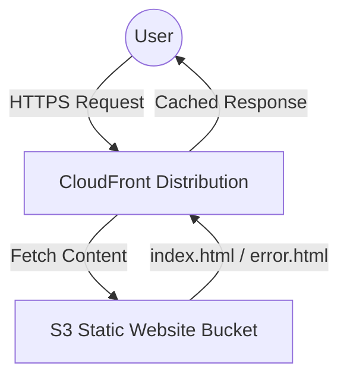

# 🚀 AWS S3 Static Website with CloudFront (Terraform)

This repository contains Terraform code to provision a **static website hosted on AWS S3** with **public access**, and **CloudFront CDN distribution** for global delivery.

---

## 📌 Features

- ✅ Creates an **S3 bucket** with tags for environment management.  
- ✅ Enables **public access** with appropriate bucket policies.  
- ✅ Configures **S3 static website hosting** with `index.html` and `error.html`.  
- ✅ Uploads static files (`index.html`, `error.html`) directly via Terraform.  
- ✅ Sets up a **CloudFront distribution** with HTTPS and caching.  
- ✅ Provides outputs for direct **S3 website URL** and **CloudFront CDN URL**.  

---

## 🏗️ Architecture



This setup ensures:
- Global, low-latency delivery via CloudFront.  
- Resilient hosting with S3 static website hosting.  
- Secure HTTPS with automatic redirects.  

---

## 🛠️ Prerequisites

- [Terraform](https://developer.hashicorp.com/terraform/downloads) ≥ 1.0  
- AWS CLI configured with valid credentials (`aws configure`)  
- An AWS account with permissions for **S3** and **CloudFront**  

---

## ⚙️ Variables

This configuration expects the following variables:

| Variable         | Description                           | Example             |
|------------------|---------------------------------------|---------------------|
| `aws_region`     | AWS region for resources              | `us-east-1`         |
| `s3_bucket_name` | Name of the S3 bucket (must be unique)| `my-static-website` |

You can define them in a `variables.tf` file:

```hcl
aws_region     = "us-east-1"
s3_bucket_name = "my-unique-static-site-123"
```

---

## 🚀 Deployment Steps

1. **Clone this repository**
   ```bash
   git clone git@github.com:Ahmetnasri/Project-AWS.git
   cd Project-AWS
   git checkout S3
   ```

2. **Initialize Terraform**
   ```bash
   terraform init
   ```

3. **Validate configuration**
   ```bash
   terraform validate
   ```

4. **Plan the changes**
   ```bash
   terraform plan
   ```

5. **Apply the configuration**
   ```bash
   terraform apply
   ```

---

## 🌐 Outputs

After deployment, Terraform will provide:

- **S3 URL (direct access):**  
  ```
  https://<bucket-name>.s3.<region>.amazonaws.com/index.html
  ```
- **CloudFront CDN URL (recommended):**  
  ```
  https://<cloudfront-domain-name>/
  ```

---

## 📂 Project Structure

```
├── main.tf           # Terraform configuration
├── variables.tf      # Variable definitions
├── outputs.tf        # Output values
├── index.html        # Default homepage
├── error.html        # Custom error page
└── README.md         # Project documentation
```

---

## 🧹 Cleanup

To destroy all resources:

```bash
terraform destroy -auto-approve
```

⚠️ **Note:** This will permanently delete the S3 bucket and all uploaded files.

---
